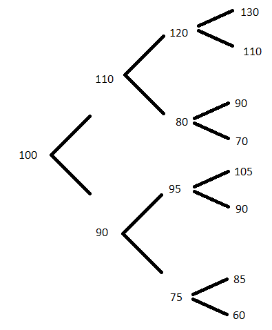

# The risk-neutral framework

A key concept to understanding this section is the existence of a risk-free interest rate $r$ at which one may invest cash to accumulate into the future with no chance of loss/default.  In practice, US treasury rates or LIBOR may be used as near-riskless rates.

## Forwards

A forward is a promise now to buy an asset (think stock) at a prescribed future time $T$.  What should be the price of the forward, which is paid at time $T$?

Someone with experience in probability or statistics might come up with the following answer.  Suppose we have a perfect model of the future price, say, $\log S_T/S_0 = X$ where $X\sim N(\mu, \sigma^2)$; that is, the log price change is a normal fluctuation up or down.  The price of the forward, say $F$, is paid at time $T$, so that the payoff of the forward is $S_T - F$.  The value of the payoff at time $0$ is $e^{-rT}(S_T - F)$ and the expected value of the payoff at time $0$ is
\[E(e^{-rT}(S_T - F)) = e^{-rT}\left[S_0e^{\mu + \sigma^2/2}-F\right].\]
It would seem that either the holder or the seller of the forward contract would be disadvantaged if $F$ is anything other than $S_0e^{\mu + \sigma^2/2}$, but this is incorrect!

Here's why.  Pretend you are the seller/writer of the forward contract.  Borrow $S_0$ at time $t=0$ and buy one share.  At time $T$ deliver the stock for $K$ and repay the loan of $S_0e^{rT}$.  If $K > S_0e^{rT}$ you have made riskless profit, i.e., *arbitrage*.  On the other hand, suppose you are the buyer/holder of the forward contract.  Short a share at time $0$ and recieve $S_0$, investing it at the risk free rate $r$. At time $T$ you have $S_0e^{rT}$, you buy the stock for $F$, and you close your short position.  If $F < S_0e^{rT}$ you make riskless profit.  

The pricing lesson is that the forward price $F$ must simply be the current asset price accumulated at the risk-free rate; any other price results in arbitrage.  The bigger picture lesson is that the probabilities of asset value changes were irrelevant---only the initial asset value and the risk free rate (information known at time 0) played a role in the arbitrage-free pricing of the forward contract.  The phenomenon that arbitrage-free prices are agnostic towards probabilities of future asset value moves is known as *risk-neutrality*. 

Forwards are simple financial instruments, but it turns out that the above argument for risk-neutral pricing applies to arbitrary derivatives, as we will see next.

## Risk-neutral pricing of derivatives

Consider a derivative that provides a payoff based on the value of an underlying asset, for example, a stock.  By modeling the stock's future price moves we can replicate the derivative using a portfolio consisting of $(\phi, \psi)$ units of the stock and a risk-free bond.  

Our model consists of probabilities of prescribed up or down moves at discrete time points.  For example, the stock that has value $S_0$ at time $0$ either moves up to value $S_2$ at time 1 with probability $p$ or down to value $S_1$ at time $1$ with probability $1-p$.  The portfolio has value either $\phi S_2 + \psi B_0e^{r}$ or $\phi S_1 + \psi B_0e^{r}$ at time $1$.  And, the derivative has value either $f(S_2)$ or $f(S_1)$ at time $1$.  Set the potential portfolio values equal to the potential derivative values and solve for $\phi, \psi$, yielding
\[\phi = \frac{f(S_2)-f(S_1)}{S_2 - S_1}\quad\text{and}\quad \psi = B_0^{-1}e^{-r}[f(S_2) - \phi S_2].\]

The portfolio value at time 0 is
\[\phi S_0 + \psi B_0 = S_0 \frac{f(S_2)-f(S_1)}{S_2 - S_1} + e^{-r}\left\{f(S_2) - \frac{f(S_2)-f(S_1)}{S_2 - S_1}S_2\right\}.\]
This is an enforceable price for the derivative because any deviation up or down (in excess of bid-ask spreads) creates an arbitrage opportunity using the replicating portfolio and the derivative.  

Let $q := (S_0 e^r - S_1)/(S_2-S_1)$ and note that the portfolio value may be rewritten as
\[e^{-r}\left\{qf(S_2) + (1-q)f(S_1)\right\}.\]
This appears to be a discounted expected value.  And, indeed, if $q<0$ the future stock price is definitely higher than the bond's future value, while if $q>1$ the bond is certainly more valuable than the stock.  Therefore $q\in (0,1)$ behaves like a probability.  We call the probabilities $(q,1-q)$ the *risk-neutral probabilities* or risk-neutral measure because they do not depend on the underlying true probabilities $(p,1-p)$ of up and down stock moves; rather they are the result ofthe arbitrage-free market constraint.  

## Binomial derivative pricing model

The previous argument for derivative pricing using a replicating portfolio based on up and down asset moves suggests a practical pricing model.  In real life the asset may move anywhere in a large, continuous range from time point to time point, and may experience substantial volatility, so a model only allowing one up and one down move is not very realistic.  But, if we simply increase the number of time points within a time interval and allow for an up or down jump at each time point, we can build a risch model of asset price over time. 

Let $\Delta_t$ denote the size of the time step.  At time point $i$ the stock takes one of $2^i$ values, and, at time $i+1$, $2^{i+1}$ values. Suppose we are at time $i$, and value $S_j^i$ of $2^{i}$.  Then, 
\[f(S_j^i) = e^{-r\Delta_t}\left\{q_j^if(S_{j,u}^i)+(1-q_j^i)f(S_{j,d}^i)\right\}\]
where $(S_{j,u}^i, S_{j,d}^i)$ are the up and down stock moves from $S_j^i$, and
\[q_j^i = \frac{S_j^i e^{r\Delta_t} - S_{j,d}^i}{S_{j,u}^i-S_{j,d}^i}.\]

Notice that the derivative prices can now be computed recursively from the top of the tree (the end of the time interval) to the bottom (the start of the time interval).  For example, consider the following four-period tree of stock prices (with jump probabilities omitted):

Suppose the derivative we are pricing is a European call with strike $95$.  At time 3, from top to bottom, the payoffs are 35, 15, 0, 0, 10, 0, 0, and 0.  Suppose $r = 3\%$ and the timestep is $\Delta_t = 1$ for simplicity.  Then, at time 2 at node $120$, we have $q = (120 e^{0.03} - 110)/20 = 0.6827$ and $1-q=0.3173$.  The price of the derivative at node 120 is $e^{-0.03}(0.6827\times 35 + 0.3173 \times 15) = 27.8077$. The price at the 80 node is 0. 

Similarly, the price of the derivative at the $95$ node is $10e^{-0.03}\cdot q$ where $q = (95 e^{0.03} - 90)/15 = 0.5262$, yielding a price of $5.1066$.  

Backtracking to the time 1 nodes, we have derivative prices of 22.50 at node 110 and 4.3959 at node 90.  Finally, at time 0 (and node 100) we find the price is 15.72579.  

